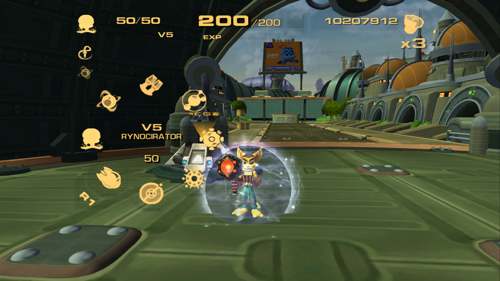

<!-- LOGO -->
<h1>

  
  
Replanetizer Maximus

</h1>
  

    Level Editor for the Ratchet and Clank Collection on PS3 **(with additional features!)**
     
    

    <a href="#features">Features</a> •
    <a href="#usage">Usage</a> •
    <a href="#building">Building</a> •
    <a href="#technology">Technology</a> •
    <a href="#licensing">Licensing</a> •
    <a href="CONTRIBUTING.md">Contributing</a>

  

# New Features

This fork adds new experimental tools and features on top of the original Replanetizer:

- **.OBJ Terrain Importing**  
  Import `.obj` 3D models directly as terrain for your levels.
  _Primarily tested with Up Your Arsenal (R&C3). Going Commando (R&C2) has NOT been tested._

- **Texture Management**  
  - Delete textures directly from the Texture Viewer window.  
  - Replace existing textures from the Texture Viewer window.  

- **GeometrySwapper (WIP)**  
  Early GUI implementation for swapping/converting R&C1 levels to R&C2 (Going Commando) or R&C3 (Up Your Arsenal).
  Currently **very** experimental but allows basic R&C1 level playability inside GC/UYA.

# Features (Original Replanetizer)

Replanetizer is still in an early state of development. Its feature set entails:

 - Visualization
   - Level objects
   - Collision
   - Splines
   - Triggers
 - Editing
   - Transformation of level objects
   - Manipulation of variables
 - Export
   - Textures (`.png`, `.jpg`, `.bmp`)
   - Rigged models including animations (`.gltf`, `.dae`, `.obj`)
   - Level as a model (`.obj`)
   - Collision (`.obj`)
 - Live inspection of a game running in emulator ([RPCS3](https://github.com/RPCS3/rpcs3))

Support for Ratchet Deadlocked is available but low priority.

> If you are looking for a level editor for the PS2 versions of the games, use [Wrench](https://github.com/chaoticgd/wrench) instead.

# Binaries

You can find prebuilt binaries of Replanetizer Maximus in the releases section:

- [Release Builds](https://github.com/KaiokenBlueGT/ReplanetizerMaximus/releases) 

# Usage

First you need to unpack the game's files so that Replanetizer can access it. These files are packed in a file called `PS3Arc.psarc`. If you have the game installed in `RPCS3`, you can find the `PS3Arc.psarc` of Ratchet and Clank 1 (NPEA00385) in `[RPCS3 Directory]/dev_hdd0/game/NPEA00385/USRDIR/rc1/ps3data`. You can unpack this file using tools like [PSArc-cl](https://github.com/MilchRatchet/PSArcInterface). It is recommended to not change the folder structure of the `PS3Arc.psarc` contents after unpacking as Replanetizer may otherwise fail to find certain files.

To load a level, start Replanetizer and use File -> Open, then select a `engine.ps3` file inside one of the level folders.

To apply changes to the game, you need to either repack the files into a `.psarc` file or use an incomplete `.psarc` file. Any file missing in a `.psarc` file will be loaded from the correspondent location outside the `.psarc` file.

You can move around the world with keyboard and mouse:

 - WASD to move camera inside the world. Hold shift to speed up movement
 - Left click items to select them
 - Rotate the camera by holding the right mouse button down and moving your mouse

> **&#9432;** If your computer has both a dedicated and an onboard GPU, make sure to use the dedicated GPU. On Windows with a dedicated Nvidia GPU, you can do this by right clicking on Replanetizer.exe and selecting "Run with graphics processor" -> "High performance NVIDIA processor".

# Building

Dependencies:

 - .NET 6 tooling (dotnet host, runtime, sdk and targeting pack)
 - For Linux (and maybe other Unixes):
   - Zenity (or KDialog if you prefer KDE dialogs)
   - Basic OpenGL dependencies (most of these will be installed if you run any form of GUI).
 - Refer to the READMEs of our NuGet       dependencies for more information if you get stuck.

To get started, clone this repository, and execute the following command:

 - `dotnet run -p Replanzetier`

Alternatively, open Replanetizer.sln in your favourite IDE, and use its tooling instead.

# Technology

The project is written in C#, and uses OpenTK4 for rendering. C# bindings for Dear ImGui are used for the UI.

We currently target .NET 6 (net6.0-windows for the Windows builds, net6.0 on anything else). We use SixLabors.ImageSharp instead of System.Drawing for cross-platform compatibility.

OpenGL 3.3 is used for the rendering.

# Licensing

Replanetizer is Copyright (C) 2018-2024, The Replanetizer Contributors.

Replanetizer is free software: you can redistribute it and/or modify
it under the terms of the GNU General Public License as published by
the Free Software Foundation, either version 3 of the License, or
(at your option) any later version.
Please see the [LICENSE.md](LICENSE.md) file for more details.

